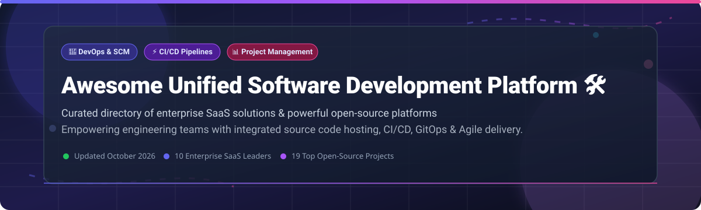

# 🛠️ Awesome Unified Software Development Platform

> A curated directory of **Enterprise SaaS Products** & **Open-Source GitHub Projects** for integrated DevOps, Source Code Management (SCM), Continuous Integration & Continuous Delivery (CI/CD), GitOps, and end-to-end software delivery.

**Last updated: October 2026** 📅

---

## 📌 Table of Contents
- [📊 Market Intelligence & Overview](#-market-intelligence--overview)
- [🏢 SaaS & Hosted Commercial Platforms](#-saas--hosted-commercial-platforms)
- [🌟 Open-Source GitHub Projects & Self-Hosted Alternatives](#-open-source-github-projects--self-hosted-alternatives)
- [🛠️ Ecosystem Comparison & Recommendations](#%EF%B8%8F-ecosystem-comparison--recommendations)
- [🤝 How to Contribute](#-how-to-contribute)
- [🛡️ Security, Governance & Compliance](#%EF%B8%8F-security-governance--compliance)
- [💖 Support & Community](#-support--community)
- [⭐ Star History](#-star-history)
- [📄 Disclaimer](#-disclaimer)

---

## 📊 Market Intelligence & Overview

> 📈 **Market Size & Structure**: The global **Unified Software Development & DevOps Platform Market** is estimated at **~$28.5 Billion USD in 2026** and projected to reach **~$55+ Billion USD by 2032** (CAGR ~11.8%).  
> 🏆 **Market Concentration**: The market is **Moderately Concentrated**. Enterprise giants like **Microsoft (GitHub & Azure DevOps)**, **AWS**, **Atlassian**, and **GitLab** control a massive share of enterprise workloads. However, high developer demand for data sovereignty, self-hosting, and specialized workflows enables a thriving ecosystem of high-growth startups (Plane, Linear, Sourcegraph) and open-source alternatives (Gitea, Drone, Argo CD).

---

## 🏢 SaaS & Hosted Commercial Platforms

Below is a comparison of leading commercial software development platforms, **sorted in descending order by Company Size / Valuation**:

| Platform | Company Valuation / Revenue 🏢 | Starting Tier Price 💰 | Free Tier / Free Trial Limits 🎁 | Primary Focus & Core Capabilities 🚀 |
| :--- | :--- | :--- | :--- | :--- |
| **[GitHub Enterprise](https://github.com/enterprise)** | **~$3.1 Trillion** (Microsoft)   *(~$2.0B GitHub ARR)* | **$21.00** / user / month *(Enterprise)* | **Free Forever**: Unlimited public & private repos, 2,000 CI/CD mins/mo, 500MB Packages storage | World's standard for Git hosting, GitHub Actions CI/CD, Security Advisory, Advanced Security & Copilot AI integration. |
| **[Azure DevOps](https://azure.microsoft.com/en-us/products/devops)** | **~$3.1 Trillion** (Microsoft) | **$6.00** / user / month *(Basic Plan)* | **Free Forever (First 5 users)**: Free Azure Repos, Boards, 1,800 free CI/CD build mins/mo | Comprehensive enterprise DevOps suite with Repos, Pipelines, Boards, Test Plans, and native Azure integrations. |
| **[AWS CodeCatalyst](https://aws.amazon.com/codecatalyst/)** | **~$2.1 Trillion** (Amazon) | **$20.00** / user / month *(Enterprise)* | **Free Tier**: 2,000 CI/CD build mins/mo, 64 GB cloud dev environment hours/mo, 60 project mins/mo | Unified AWS-native development environment with automated project blueprints, dev environments, and deployment pipelines. |
| **[Atlassian Jira](https://www.atlassian.com/software/jira)** | **~$45.0 Billion**   *(~$4.8B Annual Revenue)* | **$8.15** / user / month *(Standard)* | **Free Forever**: Up to 10 users, 2GB file storage, community support, Scrum & Kanban boards | Industry standard for Agile project tracking, roadmap management, enterprise issue tracking, and deep VCS integrations. |
| **[Bitbucket](https://bitbucket.org/)** | **~$45.0 Billion** (Atlassian) | **$3.00** / user / month *(Standard)* | **Free Forever**: Up to 5 users, 500 CI/CD build mins/mo, 1GB Git LFS storage | Code hosting & CI/CD platform tightly integrated with Jira, Confluence, and Atlassian ecosystem security controls. |
| **[GitLab Ultimate](https://about.gitlab.com/)** | **~$8.5 Billion**   *(~$750M ARR)* | **$29.00** / user / month *(Premium)* | **Free Forever**: Up to 5 users/namespace, 5GB storage, 400 compute mins/mo | All-in-one DevOps platform covering SCM, CI/CD, Container Registry, DAST/SAST security scanning, and compliance. |
| **[Sourcegraph](https://sourcegraph.com/)** | **~$2.6 Billion** *(Valuation)* | **$49.00** / user / month *(Enterprise)* | **14-Day Free Trial**: Full Enterprise feature access including universal code search & Cody AI assistant | Enterprise universal code search, navigation, batch changes across multi-repository monorepos and enterprise codebases. |
| **[CircleCI](https://circleci.com/)** | **~$1.7 Billion** *(Valuation)* | **$15.00** / month *(Performance)* | **Free Forever**: 30,000 credits/mo (~6,000 build mins/mo), up to 5 active seats | High-performance continuous integration and delivery platform featuring Docker layer caching, reusable Orbs, and test splitting. |
| **[Linear](https://linear.app/)** | **~$1.25 Billion** *(Valuation)* | **$8.00** / user / month *(Standard)* | **Free Forever**: Up to 250 active issues, unlimited team members, full API access | Modern, ultra-fast issue tracker built for high-velocity software teams with keyboard-first navigation and GitHub sync. |
| **[JetBrains Space](https://www.jetbrains.com/space/)** | **~$500+ Million** *(Revenue)* | **$8.00** / user / month *(Team Plan)* | **Free Forever**: Unlimited users, 2,000 CI/CD credits/mo, 10GB package storage, 50GB data transfer | Integrated team environment combining Git hosting, code review, automation pipelines, packages, issues, and JetBrains IDE integration. |

---

## 🌟 Open-Source GitHub Projects & Self-Hosted Alternatives

Discover top self-hosted and open-source platforms for code hosting, CI/CD, GitOps, and issue tracking. **Sorted in descending order by GitHub Star Count** ⭐️:

1. **[Plane](https://github.com/makeplane/plane)** — **60,409 stars**  
     
   🔥 Modern open-source project management platform and Jira alternative. Features AI-native Work Items, Cycles, Modules, Pages, and custom Kanban views.

2. **[Gitea](https://github.com/go-gitea/gitea)** — **58,314 stars**  
     
   🍵 Ultra-lightweight, fast, self-hosted Git service written in Go. Provides pull requests, issues, wikis, packages, and built-in Actions-style CI.

3. **[Gogs](https://github.com/gogs/gogs)** — **47,858 stars**  
     
   ⚡ Painless self-hosted Git service. Designed for low resource footprint, running on Windows, macOS, Linux, and ARM architectures like Raspberry Pi.

4. **[Drone CI](https://github.com/harness/drone)** — **38,487 stars**  
     
   📦 Container-native continuous integration platform built on Docker. Configured via simple YAML pipeline declarations.

5. **[Jenkins](https://github.com/jenkinsci/jenkins)** — **26,618 stars**  
     
   🏗️ The legendary extensible open-source automation server. Supported by thousands of plugins for building, deploying, and automating software projects.

6. **[GitLab Community Edition](https://github.com/gitlabhq/gitlabhq)** — **24,555 stars**  
     
   🦊 Complete self-managed DevOps platform containing Git SCM, powerful CI/CD pipelines, container registry, and issue tracking in a single codebase.

7. **[Argo CD](https://github.com/argoproj/argo-cd)** — **24,332 stars**  
     
   🐙 Declarative GitOps continuous delivery tool for Kubernetes. Continuously monitors live clusters and reconciles state with Git repositories.

8. **[Dagger](https://github.com/dagger/dagger)** — **16,319 stars**  
     
   🗡️ Programmable CI/CD engine that lets developers define build & delivery pipelines as code in Python, Go, or TypeScript running in containers.

9. **[OpenProject](https://github.com/opf/openproject)** — **16,319 stars**  
     
   📋 Leading open-source project management software supporting classic Gantt chart project planning, Agile boards, time tracking, and cost reporting.

10. **[OneDev](https://github.com/theonedev/onedev)** — **15,278 stars**  
      
    ⚡ All-in-one autonomous DevOps platform with Git hosting, robust visual CI/CD pipeline generator, issue tracking, and code intelligence.

11. **[Phabricator](https://github.com/phacility/phabricator)** — **12,292 stars**  
      
    🛠️ Suite of open-source web applications for code review (Differential), repository hosting, bug tracking (Maniphest), and project communication.

12. **[Sourcegraph Open Source](https://github.com/sourcegraph/sourcegraph-public-snapshot)** — **10,294 stars**  
      
    🔍 Code search and intelligence engine supporting cross-repository navigation, code graph analysis, and structural search.

13. **[GitBucket](https://github.com/gitbucket/gitbucket)** — **9,402 stars**  
      
    🪣 Easy-to-install GitHub clone powered by Scala. Features repository viewing, pull requests, issues, wiki, and plugin expansion.

14. **[Tekton Pipelines](https://github.com/tektoncd/pipeline)** — **9,075 stars**  
      
    🧩 Cloud-native Kubernetes CRD pipeline framework for creating composable, multi-stage continuous integration and delivery tasks.

15. **[Flux CD](https://github.com/fluxcd/flux2)** — **8,438 stars**  
      
    ⚡ Open and extensible continuous delivery solution for Kubernetes, keeping clusters in sync with configuration sources like Git and Helm.

16. **[Woodpecker CI](https://github.com/woodpecker-ci/woodpecker)** — **7,956 stars**  
      
    🪵 Community-driven fork of Drone CI. Lightweight Docker-based continuous integration engine designed for simple deployment.

17. **[Redmine](https://github.com/redmine/redmine)** — **6,042 stars**  
      
    🔴 Flexible project management web application written in Ruby on Rails with multi-project support, Gantt charts, and role-based access.

18. **[Taiga](https://github.com/taigaio/taiga-back)** — **855 stars**  
      
    🐯 Open-source Agile project management platform for Scrum and Kanban teams with backlog prioritization and sprint tracking.

19. **[Gerrit](https://github.com/gerrit-review/gerrit)** — **414 stars**  
      
    🔍 Web-based code review and project management tool designed specifically for Git repositories at enterprise scale.

---

## 🛠️ Ecosystem Comparison & Recommendations

When choosing between enterprise SaaS platforms and self-hosted open-source software, evaluate based on your organization's core priorities:

- 🚀 **For Enterprise Managed Scaling & AI Copilots**: Choose **GitHub Enterprise** or **GitLab Ultimate**. They deliver unmatched developer tools, AI acceleration, and managed compliance.
- ⚡ **For Ultra-Fast Agile Issue Tracking**: Pair **Linear** or **Plane** with lightweight Git hosting.
- 🛡️ **For Complete Air-Gapped Data Sovereignty**: Deploy **Gitea** or **GitLab CE** on private infrastructure.
- ☸️ **For Cloud-Native Kubernetes GitOps**: Integrate **Argo CD** or **Flux** into your deployment pipeline.

---

## 🤝 How to Contribute

Contributions are welcome! Please follow these simple guidelines:

1. 🍴 **Fork the Repository**
2. 📝 **Add or Update Information** in `README.md` maintaining accurate formatting.
3. 🔗 **Include Factual Details**: Ensure valid pricing data, official documentation links, and appropriate category tags.
4. 📬 **Submit a Pull Request** with a clear title and summary of changes.

---

## 🛡️ Security, Governance & Compliance

- 🔒 **Pipeline Hardening**: CI/CD pipelines have access to deployment secrets, registry tokens, and production infrastructure. Always isolate build runners, rotate secrets, and enforce least privilege.
- 📜 **Software Supply Chain Security**: Enforce artifact signing, dependency vulnerability scanning (SAST/SCA), and software bill of materials (SBOM) generation.
- 🏛️ **Governance**: Verify data residency and RBAC policies when hosting code on commercial cloud environments.

---

## 💖 Support & Community

Thank you for using and exploring **Awesome Unified Software Development Platform**! If you find this repository valuable, please consider supporting the project:

- ⭐ **Star this repository** to help others discover it.
- 🍴 **Fork & Contribute** to expand and refine our curated list.
- 📢 **Share with your network**, DevOps peers, and engineering teams.
- ☕ **Sponsor / Buy me a coffee**: If you'd like to support ongoing open-source maintenance, check out the [GitHub Sponsor Dashboard](https://github.com/sponsors/ishandutta2007).

---

## ⭐ Star History

---

## 📄 Disclaimer

This repository is a community-curated collection intended for educational and reference purposes. All product names, trademarks, logos, and brands belong to their respective owners.

---

⭐ **Star this repository if you find it helpful!** Made for platform engineers, DevOps leaders, and software architects worldwide.
